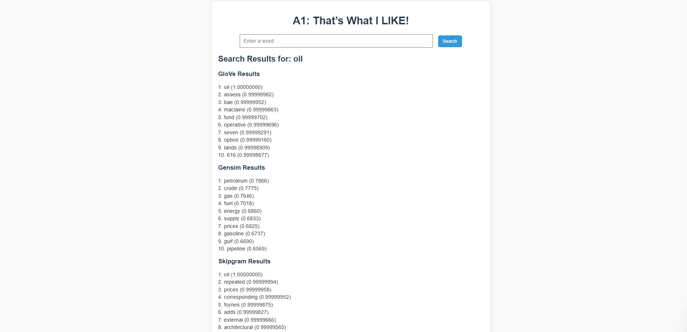

# Student info
Name : Zwe Htet
Student ID : st125338

## **Acknowledgments**

This project was developed with the help of code and guidance provided by professor, as well as assistance from friends and seniors. Their contributions and guidance were invaluable in understanding the concepts and implementation. Special thanks to everyone who supported.

# Natural Language Processing: A1 Assignment

This repository contains the implementation and experiments for the **"That’s What I LIKE"** assignment. The goal is to build a system to find similar contexts in text using word embeddings and deploy it on a web interface.

## Table of Contents
1. [Overview](#overview)
2. [Installation](#installation)
3. [Usage](#usage)
4. [Experiments and Results](#experiments-and-results)
5. [Web Application](#web-application)
6. [Dataset Attribution](#dataset-attribution)

---

## Overview

This project implements and compares various word embedding models:
- **Word2Vec Skip-gram** (with and without negative sampling)
- **GloVe**

Additionally, it includes a web application for retrieving top 10 similar paragraphs for a given query using dot product similarity.

### Key Features
1. Implementation of custom Word2Vec and GloVe models.
2. Comparison of models based on:
   - Training loss and time
   - Syntactic and semantic accuracy
   - Correlation with human similarity metrics
3. Web-based search interface for context similarity retrieval.

---

## Installation

### Prerequisites
- Python 3.8 or later
- Virtual environment tool 
- Recommended libraries:
  - `numpy`
  - `pandas`
  - `nltk`
  - `gensim`
  - `scipy`
  - `flask`

---

## Usage

### Running the Experiments
1. Open the Jupyter Notebook:
   ```bash
   jupyter notebook task_2_analysis.ipynb
   ```
2. Follow the cells to train and compare models.

### Launching the Web Application
1. Navigate to the `app` folder:
   ```bash
   cd code/app
   ```
2. Run the web server:
   ```bash
   python app.py
   ```
3. Open your browser and navigate to:
   ```
   http://127.0.0.1:5000
   ```
4. Enter a single word to retrieve the top 10 similar contexts.

---

## Experiments and Results

### Model Comparison
The following models were trained and evaluated:
- **Skip-gram**
- **Skip-gram with negative sampling**
- **GloVe**
- **GloVe (Gensim Pre-trained)**

#### Metrics
- **Training Parameters**
1. window size   = 2
2. batch size    = 2
3. embedded size = 2
4. epoch         = 1000

- **Training Loss and Time**: Captures the efficiency and convergence of the models.
- **Accuracy**:
  - **Syntactic Tasks**: Example: Capital-common-countries.
  - **Semantic Tasks**: Example: Past-tense.

| Model                | Training Loss | Training Time | Syntactic Accuracy  | Semantic Accuracy | Similarity Corr   |
|----------------------|---------------|---------------|---------------------|-------------------|-------------------|
| Skip-gram            | 3 min 24 sec  | 10.106943     | 0.00%               | 0.00%             | 0.2254            |
| Skip-gram (NEG)      | 3 min 17 sec  |  2.880926     | 0.00%               | 0.00%             | 0.2899            |
| GloVe                | 1 min  9 sec  |  8.504427     | 0.00%               | 0.00%             | 0.1609            |
| GENSIM               | GENSIM        | GENSIM        | 63.11%              | 55.45%            | 0.6038            |

- **Correlation with Human Similarity Metrics**: Assessed using Spearman's rank correlation (dataset - wordsim_similarity_goldstandard)- 0.9677

### Observations
- Include key findings and challenges encountered.

---

## Web Application

The web application allows users to:
- Input a query (e.g., "dollar").
- Retrieve the top 10 paragraphs with the most similar context from the trained corpus.

### Features
- Dot product similarity for context retrieval.
- Scalable to additional datasets or queries.

### Screenshots




---

## Dataset Attribution

The datasets used in this project are:
1. **Training Corpus**: Categories news from the `nltk` dataset.
2. **Word Analogy Dataset**: [Mikolov’s Word Analogy Dataset](https://www.fit.vutbr.cz/~imikolov/rnnlm/word-test.v1.txt).
3. **Similarity Dataset**: [WordSim353 Dataset](http://alfonseca.org/eng/research/wordsim353.html).

---