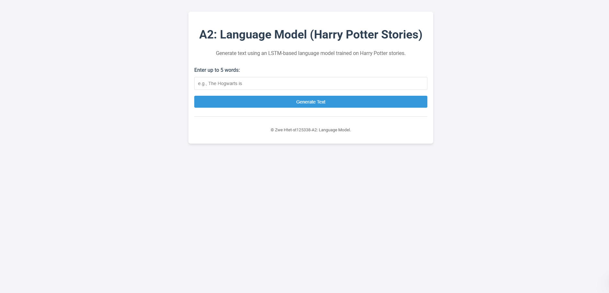
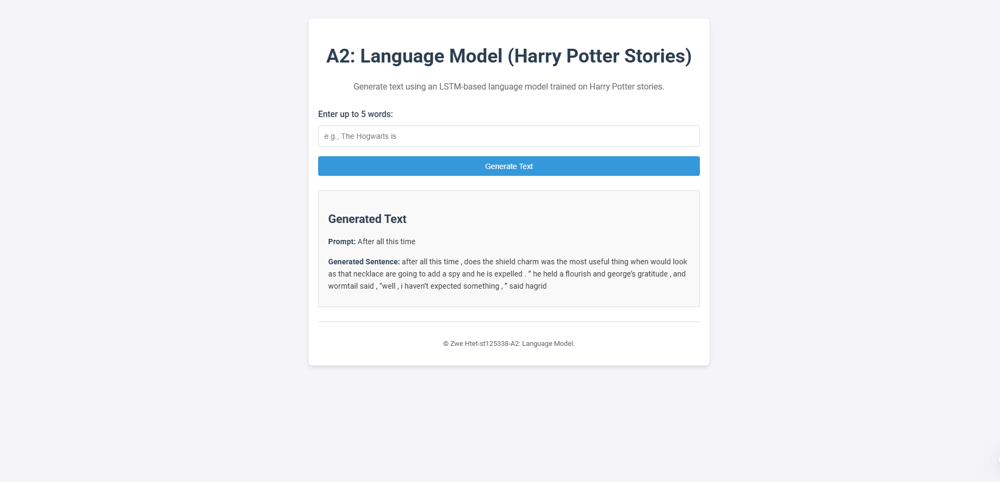

# Student Info
**Name**: Zwe Htet  
**Student ID**: st125338

---

## Acknowledgments

This project was developed under the guidance of **Professor Chaklam**. I am grateful for the invaluable assistance and support from my friends and seniors throughout this assignment. Special thanks to **Ginga1402** for providing the [Harry Potter Novels Dataset](https://github.com/Ginga1402/Harry-Potter-Dataset), which was instrumental in training the language model.

---

# Natural Language Processing: A2 Assignment

This repository contains the implementation and experiments for the **"A2: Language Model"** assignment. The objective is to train an LSTM-based language model and deploy it as a web application for text generation.

---

## Table of Contents

1. [Overview](#overview)  
2. [Installation](#installation)  
3. [Usage](#usage)  
4. [Preprocessing Steps](#preprocessing-steps)  
5. [Model Architecture and Training](#model-architecture-and-training)  
6. [Web Application](#web-application)  
7. [Dataset Attribution](#dataset-attribution)  

---

## Overview

The project involves:

1. **Dataset Acquisition**: Utilizing the [Harry Potter Novels Dataset](https://github.com/Ginga1402/Harry-Potter-Dataset) for training the language model.  
2. **Model Training**: Developing an LSTM-based language model to capture the context and style of the text.  
3. **Web Application Development**: Creating a Flask web application that allows users to input a text prompt and receive a generated continuation.

---

## Installation

### Prerequisites

- Python 3.8 or later  
- Recommended Python libraries:
  - `torch`
  - `flask`
  - `numpy`
  - `nltk`

---

## Usage

### Running the Experiments
1. Ensure the trained model file st125338_best-val-lstm_lm.pt is in the root directory.
2. Run the web server:
   ```bash
   python app.py
   ```
3. Open your browser and navigate to:
   ```
   http://127.0.0.1:5000
   ```
4. Enter up to 5 words in the input box to generate text.

---

## Preprocessing Steps

1. **Dataset Acquisition**: Utilized the [Harry Potter Novels Dataset](https://github.com/Ginga1402/Harry-Potter-Dataset) for training the language model.
2. **Format Conversion**: Converted the dataset from PDF into a format suitable for training.
3. **Text Cleaning**: Removed unwanted characters, special symbols, and extra spaces in the `Dataset_generation.ipynb` file.
4. **Tokenization**: The cleaned dataset was saved as CSV and split into tokens in the `LSTM LM_st125338.ipynb` file.
5. **Vocabulary Creation**: Built a unique vocabulary of tokens and mapped them to integer indices.
6. **Sequence Creation**: Generated fixed-length input-output pairs for training.
7. **Data Loading**: Loaded the dataset into memory for training, saved the vocabulary as pickle file for future use in web app.

---

## Model Architecture and Training

### Model Architecture 

The language model was built using a Long Short-Term Memory (LSTM) network. The architecture includes:
- An embedding layer to convert tokens into dense vector representations.
- LSTM layers to capture context and dependencies in the text.
- A fully connected output layer with a softmax activation for predicting the next token.

### Model Training

The model was trained using the following steps:
1. The dataset was split into training and validation sets.
2. The training loop minimized the cross-entropy loss using an optimizer (e.g., Adam).
3. The model checkpoint with the best validation loss was saved as `st125338_best-val-lstm_lm.pt`.

### Training Parameters

batch_size = 256
emb_dim = 1024               
hid_dim = 1024
num_layers = 2
dropout_rate = 0.65              
lr = 1e-3

epochs = 100
seq_len  = 50
clip    = 0.25

---

## Web Application

A simple Flask web application was developed to demonstrate the capabilities of the trained language model.

### Instructions to Run

1. Clone this repository.
2. Run the Flask app: `python app.py`.
3. Access the application at `http://127.0.0.1:5000`.

### Features

1. **Input Box**: Users can input up to 5 words as a text prompt.
2. **Text Generation**: The model generates a continuation of the input text based on the context and style of the training dataset.
3. **Temperature Control**: For best results, the temperature for text generation is set to 1.0.

### How It Works

1. The user provides a text prompt in the input box.
2. The application interfaces with the language model to generate the next sequence of text.
3. The generated text is displayed on the web page.

### Documentation

- The Flask app loads the trained model (`st125338_best-val-lstm_lm.pt`) into memory for inference.
- The vocabulary is loaded from a pickle file.
- The `generate_text` method of the model is used to create text continuations.
- Input validation ensures the prompt is limited to 5 words.
- The temperature parameter is set as 1 to control the randomness of the generated text.

### Screenshots





---

## Dataset-attribution

The dataset used for this project is the [Harry Potter Novels Dataset](https://github.com/Ginga1402/Harry-Potter-Dataset). Proper credit is given to the dataset provider for their contribution.
