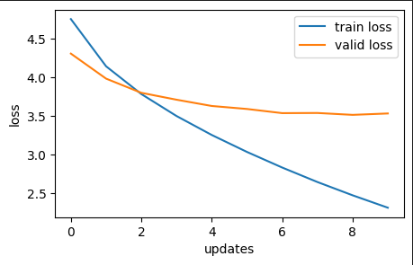
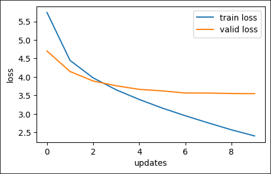
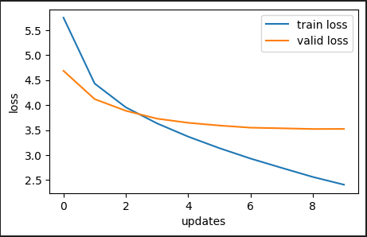
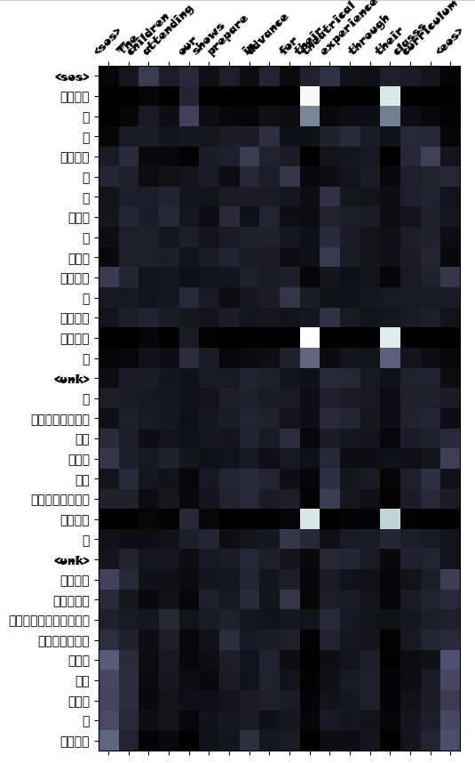
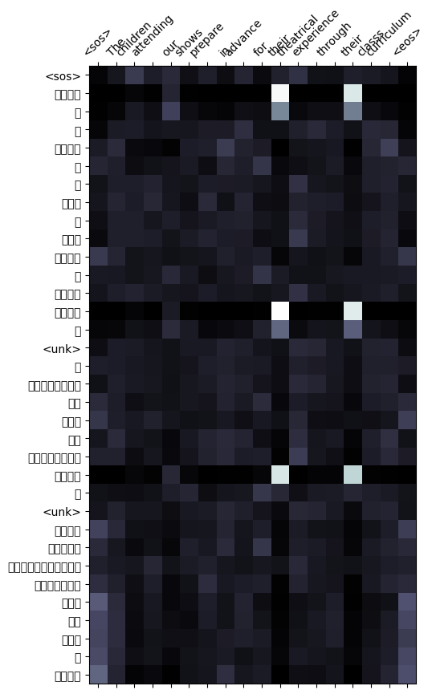
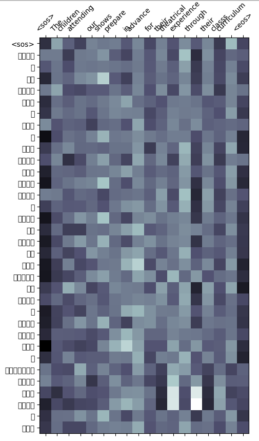
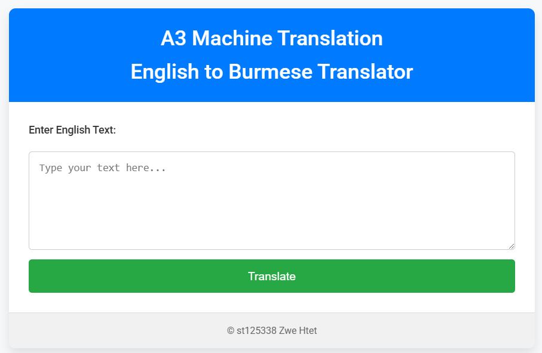
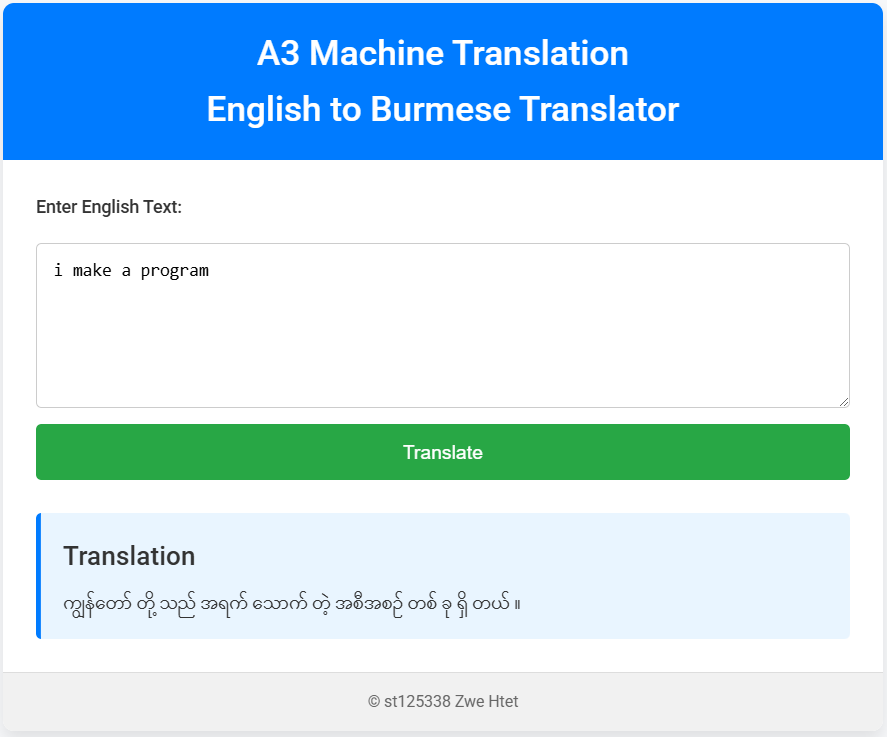

# Student Info
**Name**: Zwe Htet  
**Student ID**: st125338  

---

## Acknowledgments

This project was developed under the guidance of **Professor Chaklam** as part of the **Natural Language Understanding (NLU)** course. Special thanks to my seniors and friends for their insights and support. 

Additionally, proper credit is given to:
- **Dataset Source**: [myXNLI dataset](https://github.com/akhtet/myXNLI/tree/main)
- **Myanmar Tokenizer**: [Ye Kyaw Thu - myWord Tokenizer](https://github.com/ye-kyaw-thu/myWord)

---

# Neural Machine Translation: English to Burmese

This repository contains the implementation and experiments for the **"A3: Make Your Own Machine Translation Language"** assignment. The objective is to train a Transformer-based sequence-to-sequence translation model and deploy it as a web application.

---

## Table of Contents

1. [Overview](#overview)  
2. [Installation](#installation)  
3. [Usage](#usage)
4. [Training Data](#training-data)
5. [Preprocessing Steps](#preprocessing-steps)  
6. [Model Architecture and Training](#model-architecture-and-training)  
7. [Web Application](#web-application)  
8. [Evaluation](#evaluation)  
9. [Dataset Attribution](#dataset-attribution)  

---

## Overview

The project involves:

1. **Dataset Acquisition**: Using the [myXNLI dataset](https://github.com/akhtet/myXNLI/tree/main) for English-Burmese translation.
2. **Data Preprocessing**: Implementing text normalization, tokenization, and word segmentation using the [myWord tokenizer](https://github.com/ye-kyaw-thu/myWord).
3. **Model Training**: Developing a Transformer-based seq2seq model with different attention mechanisms (General, Multiplicative, and Additive) to compare their effectiveness.
4. **Web Application**: Deploying the trained model using Flask for real-time translation.

---

## Installation

### Prerequisites

- Python 3.8 or later  
- Recommended Python libraries:
  - `torch`
  - `torchtext`
  - `flask`
  - `numpy`
  - `spacy`
  - `pickle`

### Setup Instructions

1. Clone this repository:
   ```bash
   git clone https://github.com/your-repo/nmt-english-burmese.git
   cd nmt-english-burmese
   ```
2. Download the English tokenizer for spaCy:
   ```bash
   python -m spacy download en_core_web_sm
   ```
3. Ensure the trained model (`add_model_v4.pt`) and vocabulary file (`vocabs.pkl`) are placed inside the `app/models/` directory.

---

## Usage

### Running the Web Application
1. Start the Flask server:
   ```bash
   python app.py
   ```
2. Open your browser and navigate to:
   ```
   http://127.0.0.1:5000
   ```
3. Enter English text in the input box and click "Translate" to generate the Burmese translation.

---

## Training Data

- **Dataset Source**: [myXNLI dataset](https://github.com/akhtet/myXNLI/tree/main)
- **Training Set**: 9713 rows  
- **Validation Set**: 99 rows  
- **Testing Set**: 100 rows

---

## Preprocessing Steps

1. **Text Cleaning**: Removed unwanted characters, special symbols, and extra spaces. Remove unnecessary punctuation and lines from the text. Combined multiple files into a single dataset and uploaded to huggingface.
2. **Tokenization**:
   - Used `spacy` for English text.
   - Used `myWord` tokenizer for Burmese text segmentation.
3. **Vocabulary Creation**: Built unique vocabularies for both languages and mapped words to integer indices.
4. **Sequence Preparation**: Generated fixed-length input-output sequences for training.
5. **DataLoader Preparation**: Batched the data and applied padding for efficient training.

---

## Model Architecture and Training

### Model Architecture

The translation model is based on a Transformer with an Encoder-Decoder architecture. It includes:
- Multi-Head Attention (Self and Cross-Attention Layers)
- Position-wise Feedforward Networks
- Positional Encoding
- Additive Attention Mechanism

### Attention Mechanisms Evaluated

1. **General Attention**
2. **Multiplicative Attention**
3. **Additive Attention** (chosen for final deployment)

### Training Parameters

- Hidden Dimension: 256
- Encoder/Decoder Layers: 3
- Attention Heads: 8
- Feedforward Dim: 512
- Dropout: 0.1
- Learning Rate: 0.0005
- Epochs: 10

---

## Web Application

A Flask-based web application was developed to demonstrate real-time English-to-Burmese translation using the trained model.

### Features

1. **Input Box**: Users can enter English text.
2. **Translation Output**: The model generates and displays the corresponding Burmese translation.
3. **Modern UI**: A professionally styled interface for a real-world application feel.

### How It Works

1. User inputs English text.
2. The model processes the text, tokenizes it, and converts it into numerical form.
3. The model generates the Burmese translation using a greedy decoding approach.
4. The translated text is displayed in the UI.

---

## Evaluation

### Performance Comparison

| Attention Mechanism  | Training Loss | Training PPL  | Validation Loss | Validation PPL |
|----------------------|---------------|---------------|-----------------|----------------|
| General Attention    | 2.307         | 3.532         | 10.049          | 34.206         |
| Multiplicative       | 2.406         | 11.094        | 3.549           | 34.770         |
| **Additive**         | **2.408**     | **11.113**    | **3.523**       | **33.892**     |

### Performance Plots
| General Attention Loss  | Multiplicative Attention Loss | Additive Attention Loss  |
|-------------------------|-------------------------------|--------------------------|
||      | |

### Attention Maps
| General Attention Loss  | Multiplicative Attention Loss | Additive Attention Loss  |
|-------------------------|-------------------------------|--------------------------|
||      | |

### Conclusion

Based on the evaluation, **Additive Attention** provided the best translation quality with the lowest validation perplexity score. Therefore, this approach was chosen for the final model use in web application.

---

## Dataset Attribution

The dataset used for this project is the **myXNLI dataset**: [https://github.com/akhtet/myXNLI/tree/main](https://github.com/akhtet/myXNLI/tree/main).

Proper credit is also given to the **myWord Tokenizer**: [https://github.com/ye-kyaw-thu/myWord](https://github.com/ye-kyaw-thu/myWord).

---

## Screenshots




---


