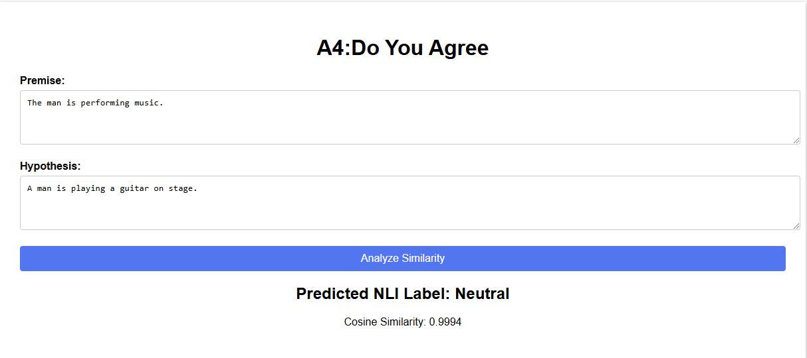

# A4: Do you AGREE?

- **Name:** Zwe Htet
- **ID:** st125338

This project is a Flask-based web application that uses a custom-trained BERT model to calculate the cosine similarity between two input sentences. The model has been fine-tuned on a sentence pair classification task and is capable of generating high-quality sentence embeddings.

## Overview

- **Purpose:**  
  To provide an interactive web interface where users can input two sentences and obtain their similarity score computed using a trained BERT model.

- **Key Features:**  
  - Custom tokenizer and data preprocessing.
  - A trained BERT model with 135,727,340 trainable parameters.
  - Computation of sentence embeddings via mean pooling.
  - Calculation of cosine similarity between sentence embeddings.
  - A simple and intuitive web interface built with Flask.

### Acknowledgments 

I would like to express my sincere gratitude to **Professor Chacklam** for continuous guidance and support and my friends and seniors for their invaluable help and feedback.

## Content
- [Task 1 - Training BERT from Scratch](#task-1---training-bert-from-scratch)
- [Task 2 - Sentence BERT](#task-2---sentence-bert)
- [Task 3 - Evaluation and Analysis](#task-3---evaluation-and-analysis)
- [Task 4 - Web Application](#task-4---web-application)

## Task 1 - Training BERT from Scratch

### Introduction
This report evaluates the implementation of a Siamese-BERT (S-BERT) model for Natural Language Inference (NLI) classification using the MNLI dataset.

- **Dataset:** BookCorpus
- **Hyperparameters:**
  - Number of Encoder Layers: 6  
  - Number of Heads in Multi-Head Attention: 8  
  - Embedding Size / Hidden Dim: 768  
  - Number of Epochs: 1000  
  - Training Data: 740,042 sentences  
  - Dimension of K (and Q, V): 64  
  - Vocab Size: 60,305  
- **Model Save Location:** The trained model weights are saved in `app/models/bert-from-scratch.pt`.

## Task 2 - Sentence BERT

- **Dataset:** SNLI
- **Hyperparameters for Tuning S-BERT on our BERT Model:**
  - Training Data: 1,500 rows  
- **Model Architecture:**  
  - **Number of Layers:** 12  
  - **Number of Attention Heads:** 12  
  - **Embedding Dimension (d_model):** 768  
  - **Feed-Forward Dimension (d_ff):** 3072  
  - **Attention Head Dimension (d_k):** 64  
- **Training Parameters:**  
  - **Total Trainable Parameters:** 135,727,340  
  - **Batch Size:** 32
  - **Number of Epochs:** 5


**Model:**
- **S-BERT on our BERT model:** A custom-trained S-BERT variant based on a modified BERT architecture.

## Task 3 - Evaluation and Analysis

| Model Type               | Average Validation Cosine Similarity | Accuracy | Precision | Recall  | F1-Score |
|--------------------------|-------------------------------------:|---------:|----------:|--------:|---------:|
| S-BERT on BERT model |                              0.9997  |  0.3550  |   0.1260  | 0.3550  |  0.1860  |

## Limitations and Challenges

- **Dataset Limitations:**  
  - The project primarily uses the SNLI dataset for training, validation, and testing. While SNLI is well-known for natural language inference tasks, its domain and size may not fully capture the variability of real-world sentence pairs.  
  - The dataset might be imbalanced or insufficiently diverse, contributing to modest classification metrics.

- **Tokenization Issues:**  
  - A custom tokenizer based on a simple word-to-index mapping (`word2id`) was used. This approach lacks the robustness of advanced subword tokenizers (e.g., Hugging Face’s `BertTokenizer`), which can better handle out-of-vocabulary words and punctuation.  
  - The simplicity of the tokenizer may reduce the quality of the input representations and affect downstream performance.

- **Model Complexity:**  
  - The custom BERT model consists of 12 layers and 12 attention heads, with a total of 135,727,340 trainable parameters. This high parameter count leads to:
    - Increased computational and memory demands.
    - A heightened risk of overfitting, especially given the limited scope and potential imbalances in the training data.

- **Checkpoint and Integration Challenges:**
  - Integrating the model into a Flask web application required careful management of device contexts (CPU vs. GPU) and ensuring that the inference pipeline (tokenization, encoding, and pooling) is both robust and efficient.

## Task 4 - Web Application

### Webapp Home page and Result
- **Home Page**
  

- **Result**


### Usage
- **Input:** Two text fields to enter the sentences for comparison.
- **Output:** After clicking the **Analyze Similarity** button, the NLI classification result (similarity score and predicted relation) is displayed.

## Installation and Setup

To run the web application:

1. **Clone the Repository and Verify the Directory Structure:**

    ```
    A4_Do_You_Agree/
    ├── app.py
    ├── util_funs.py
    ├── Models/
    │   ├── bert_model_3.pt
    │   ├── final_model.pt
    ├── templates/
    │   └── index.html
    └── static/
        └── style.css
    ```

2. **Install the Required Packages:**
    ```bash
    pip install flask torch scikit-learn
    ```

3. **Run the Application:**
    ```bash
    python app.py
    ```

4. **Access the App:**
    Open your browser and navigate to [http://127.0.0.1:5000](http://127.0.0.1:5000).


