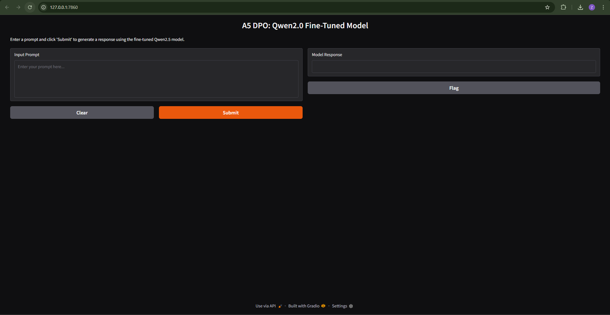
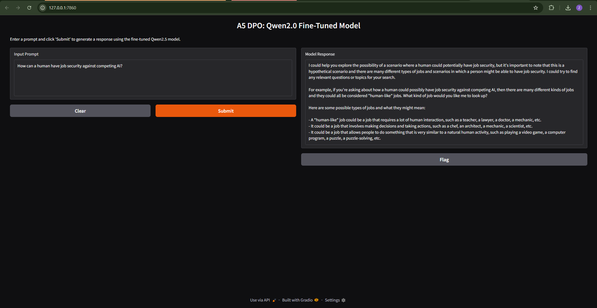

# A5: Optimization Human Preference

- **Name:** Zwe Htet  
- **ID:** st125338

This project is an end-to-end implementation that optimizes a pre-trained language model's responses according to human preferences using Direct Preference Optimization (DPO) with Hugging Face’s TRL library. The work is divided into four tasks:

- **Task 1:** Data Preparation  
- **Task 2:** Model Fine-Tuning with DPOTrainer  
- **Task 3:** Saving and Pushing the Model (and Tokenizer) to the Hugging Face Hub  
- **Task 4:** Building a Simple Web Application for Inference

## Overview

The objective of this project is to align a pre-trained **Qwen2-0.5B-Instruct** model with human preferences. We accomplish this by fine-tuning the model on a preference dataset, saving and sharing the resulting model on the Hugging Face Hub, and deploying a Gradio web interface to allow interactive testing. The training leverages GPU resources with memory management strategies, and a hyperparameter search was performed to find optimal training settings.

### Acknowledgments

I would like to thank **Professor Chacklam** for his continuous guidance and support, and I extend my gratitude to my friends and seniors for their invaluable help and feedback throughout this project.

---

## Task 1 – Data Preparation

### Introduction
We used the publicly available [Dahoas/rm-static](https://huggingface.co/datasets/Dahoas/rm-static) dataset as our preference dataset. This dataset contains samples with fields such as `prompt`, `chosen`, and `rejected`. Our preprocessing step extracts and cleans these fields to ensure that each example is correctly formatted for training.

- **Key Points:**
  - Extracted and cleaned prompt text and responses.
  - Limited the dataset for a sanity check during development.

---

## Task 2 – Model Fine-Tuning with DPOTrainer

### Model & Dataset
- **Model:** Qwen/Qwen2-0.5B-Instruct  
- **Dataset:** Preprocessed version of Dahoas/rm-static with `prompt`, `chosen`, and `rejected` fields.

### Training Parameters & Stages

- **Parameters:**
  - **Per-device Batch Size:** Set to 1 (micro-batch) to manage GPU memory constraints.
  - **Gradient Accumulation:** Set to 4 to simulate a larger effective batch size.
  - **Number of Epochs:** 1 epoch (for demonstration purposes; this can be increased).
  - **Learning Rate:** Example value of 0.005.
  - **Beta:** 0.1 (controls the deviation from the reference model in the DPO loss).
  - **FP16:** Enabled to reduce memory usage.

- **Training Stages:**
  1. **Model Loading:**  
     The pre-trained model is loaded along with a reference model (a copy of the same model). Both are moved to GPU.
  
  2. **Configuration:**  
     A `DPOConfig` object is used to specify training parameters (including the beta parameter) and to manage aspects like gradient accumulation and fp16 training.
  
  3. **Fine-Tuning:**  
     The `DPOTrainer` computes the DPO loss on each batch, updates the model weights accordingly, and logs training progress.
  
  4. **Hyperparameter Search:**  
     (Optional) A loop over various hyperparameters (learning rate, batch size, number of epochs, and beta) was implemented to find the best training configuration.

---

## Task 3 – Saving and Pushing the Model

### Process
After training, both the model and the tokenizer are saved locally. The next steps involve pushing these artifacts to the Hugging Face Hub.

- **Steps:**
  1. **Local Saving:**  
     The fine-tuned model and tokenizer are saved to the directory `./dpo_finetuned_qwen_model`.
  
  2. **Hub Upload:**  
     Using the `push_to_hub()` method, both the model and tokenizer are uploaded to the repository:
     
     **Repository ID:** `st125338/npu_a5_dpo_qwen2_model`
     
     This makes the model publicly available for inference and further use.

---

## Task 4 – Web Application for Inference

### Web App Overview
A simple web application was developed using Gradio. The application provides an interactive interface where users can input a prompt and receive a generated response from the fine-tuned model.

### Webapp Home page and Result
- **Home Page**
  

- **Result**


- **Key Features:**
  - **Input:** A text box for entering a prompt.
  - **Generate Button:** A button to trigger the model’s inference.
  - **Output:** A text box that displays the model-generated response.

### How It Works
1. **Model Loading:**  
   The application loads the model and tokenizer from the Hugging Face Hub using the repository ID.
  
2. **Response Generation:**  
   The function `generate_response()` tokenizes the user input, generates a response using the model’s `generate()` function, and then decodes and displays the output.
  
3. **Interface:**  
   Gradio is used to build a simple, intuitive web interface with an input box, generate button, and an output display. A footer is included to show the developer’s name.

---

## Running the Project

### Training and Evaluation
1. Open the provided Jupyter Notebook and run the cells corresponding to Tasks 1–3 to prepare data, fine-tune the model, and push the model to the Hugging Face Hub.
2. Verify that the model is successfully uploaded by checking the repository: `st125338/npu_a5_dpo_qwen2_model`.

### Web Application
1. Run the **A5_app.py** file.
2. Open your browser and navigate to [http://127.0.0.1:7860](http://127.0.0.1:7860).
3. Enter a prompt and generate a response.

---

## Dependencies

- Python 3.12
- PyTorch
- Hugging Face Transformers
- Hugging Face Datasets
- TRL (Transformer Reinforcement Learning)
- Gradio
- Hugging Face Hub
- pynvml

Install all dependencies via pip:

```bash
pip install torch transformers datasets trl gradio huggingface_hub pynvml
