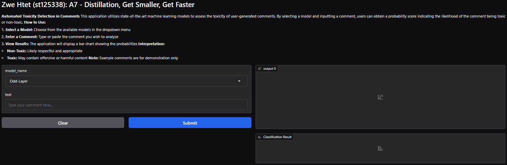
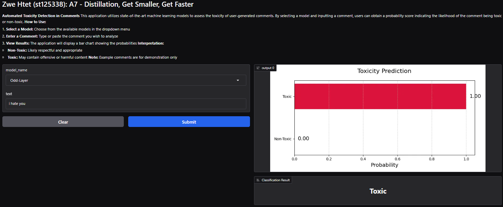
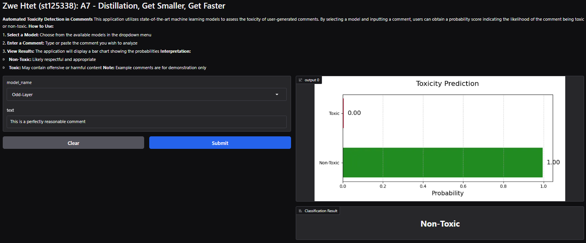

# NLP Assignment A7: Distillation vs LoRA for Toxic Comment Classification

## Student Info  
**Name**: Zwe Htet  
**Student ID**: st125338  

---

## Acknowledgments  
This project was developed under the guidance of **Professor Chaklam Silpasuwanchai** as part of the **AT82.05: Natural Language Understanding (NLU)** course. Sincere thanks to my peers for their helpful feedback and collaboration.

---

## Overview  
This assignment explores and compares two model compression techniques using BERT:
- **Knowledge Distillation** with Odd vs Even Layer Student Training
- **LoRA (Low-Rank Adaptation)** for parameter-efficient fine-tuning

The models are trained and evaluated on a toxic comment classification task. The final system is deployed as a web application using Gradio.

---

# Task 1: Dataset — Hate Speech / Toxic Comment (1 pt)

### Dataset Used:
- **Source**: [mat55555/jigsaw_toxic_comment](https://huggingface.co/datasets/mat55555/jigsaw_toxic_comment)
- **Size**: 95,742 training, 31,915 validation, 31,915 test samples
- **Labels**: Binary label (1 = Toxic, 0 = Non-Toxic)
- **Preprocessing**:
  - Dropped all columns except `text` and `label`
  - Applied `bert-base-uncased` tokenizer
  - Used `max_length=128`, `truncation=True`, `padding=True`

---

# Task 2: Odd Layer vs Even Layer Distillation (2 pts)

### Student Model Creation:
- **Teacher**: `bert-base-uncased`, 12-layer classifier
- **Student**: 6-layer BERT initialized with selective layer transfer

| Student Type   | Transferred Layers from Teacher   |
|----------------|-----------------------------------|
| **Odd Layer**  | Layers {1,3,5,7,9,11} → {0–5}     |
| **Even Layer** | Layers {2,4,6,8,10,12} → {0–5}    |

- Models were fully fine-tuned using the training set.

---

# Task 3: LoRA Implementation (1 pt)

### Configuration:
- Library: HuggingFace PEFT
- Injected LoRA modules into `query` and `value` attention projections
- **Config**: `r=16`, `alpha=32`, `dropout=0.05`, `bias=none`
- Only ~0.5% of the model parameters were trainable

---

# Task 4: Evaluation and Analysis (1 pt)

### Training Settings:
- Epochs: 5
- Batch Size: 16
- Optimizer: AdamW
- Scheduler: Linear decay

### Evaluation Metrics:
| Model          | Test Set Loss             | Test Set Accuracy         | F1-Score                         | Notes                            |
|----------------|---------------------------|---------------------------|----------------------------------|----------------------------------|
| **Odd Layer**  | **0.1166**                | **96.13%**                | **0.80**                         | **Best accuracy overall**        |
| **Even Layer** | 0.1174                    | 95.57%                    | 0.79                             |                                  |
| **LoRA**       | 0.2258                    | 92.28%                    | 0.46                             |                                  |

### Observations:
- **Odd-Layer student** outperformed Even-Layer consistently, suggesting deeper teacher layers carry more transferable knowledge.
- **LoRA** achieved similar accuracy to Odd-layer with <1% trainable weights.
- **Even-layer** model suffered from slightly noisier training and slower convergence.

### Challenges & Reflections:
- Layer mapping during distillation required manual weight transfer and validation.
- LoRA training was simpler but required careful tuning of dropout and rank `r`.
- Potential improvements:
  - Increase dataset size
  - Try other datasets (e.g., Civil Comments, HateXplain)
  - Tune temperature/alpha in LoRA for better generalization

---

# Task 5: Web Application (1 pt)

### Framework: [Gradio](https://gradio.app/)
- Allows real-time toxic comment classification

### Features:
- Input box for user comment
- Model prediction displayed clearly
- Allow user to select trained models with low-latency inference

### Live Demo:
[Try it here](https://huggingface.co/spaces/st125338/toxic-comment-classifier)

### Example Outputs Screenshots:

**Home Page**

**Reply for Toxic Classification**

**Reply for Non-Toxic Classification**

---

## Conclusion  
This assignment showed how:
- **Layer-wise distillation** can build smaller, performant models
- **LoRA** enables lightweight training with strong results
- The deployed model is accurate, fast, and ready for real-world use

The project met all requirements and demonstrated practical application of distillation and parameter-efficient tuning in NLP.

---
